# Database Design & Entity Relationship Diagram (ERD)

## 1. Schema Overview
The database is designed to be **Relational** (PostgreSQL) to ensure consistency in the critical many-to-many relationships (Mentors <-> Clients, Users <-> Teams).

## 2. Entity Relationship Diagram (Mermaid)

```mermaid
erDiagram
    USERS ||--|| PROFILES : has
    USERS }|--|| ROLES : has
    USERS }|--|| TEAMS : belongs_to
    
    TEAMS ||--|{ SESSIONS : participates_in
    USERS ||--|{ SESSIONS : attends
    
    SESSIONS ||--|{ ACTION_ITEMS : generates
    SESSIONS ||--|{ TRANSCRIPTS : has

    MENTOR_RELATIONSHIPS }|--|| USERS : mentor
    MENTOR_RELATIONSHIPS }|--|| USERS : mentee

    TEAMS ||--|{ GROWTH_METRICS : tracks
    TEAMS ||--|{ STRATEGIC_PLANS : develops

    USERS {
        uuid id PK
        string email
        string password_hash
        uuid role_id FK
        uuid team_id FK
        timestamp created_at
        timestamp last_login
    }

    ROLES {
        string code PK "SA, AM, M, EC"
        string name
        json permissions "Access Control List"
    }

    TEAMS {
        uuid id PK
        string name
        string industry
        string plan_tier "Elevate/Scale"
        json org_structure "Draggable Org Chart Data"
    }

    SESSIONS {
        uuid id PK
        uuid host_user_id FK
        timestamp scheduled_at
        text notes
        string zoom_url
        string status "Scheduled/Completed/Cancelled"
    }

    ACTION_ITEMS {
        uuid id PK
        uuid session_id FK
        uuid assignee_user_id FK
        text description
        string status "Open/Done"
        date due_date
    }

    GROWTH_METRICS {
        uuid id PK
        uuid team_id FK
        string type "Revenue, Headcount, Profit"
        decimal value
        date period_start
        date period_end
    }
```



## 3. Data Normalization Strategy

### Third Normal Form (3NF)
We strictly adhere to 3NF for core transactional data to prevent anomalies:
*   **Users** are separated from **Teams**. A user belongs to a team; we do not store team names in the user table.
*   **Sessions** are discrete entities linked to participants via a join table or array of IDs (if using Postgres Arrays) to allow multiple attendees.

### Exceptions (Denormalization for Performance)
*   **Org Charts**: The Organizational Structure is stored as a `JSONB` blob within the `TEAMS` or a dedicated `ORG_CHARTS` table.
    *   *Reason*: Org charts are hierarchical trees. Retrieving them via recursive SQL queries is expensive. Storing the tree as a JSON object allows the frontend (React Flow) to consume it directly with O(1) retrieval time.
*   **Audit Logs**: Stored in a specialized time-series manner or appended raw for write speed.

## 4. Key Data Models

### User Context & RBAC
The `ROLES` table drives the security.
*   `permissions` column (JSONB):
    ```json
    {
      "can_view_financials": true,
      "can_edit_users": false,
      "modules_access": ["strategy", "directory"]
    }
    ```

### Mentor-Client Matching
We use a `MENTOR_RELATIONSHIPS` table rather than a simple foreign key on User, to allow for history tracking (e.g., "Who was John's mentor in 2023?").
*   Columns: `id`, `mentor_id`, `client_id`, `start_date`, `end_date`, `status` (Active/Past).

## 5. Migration Strategy
To move from the current `mockDataService` to this DB:
1.  **Seed Scripts**: Write Node.js scripts to read the arrays in `mockDataService.ts` and `INSERT` them into Postgres.
2.  **Idempotency**: Ensure migration scripts can run multiple times without duplicating data (use `ON CONFLICT DO NOTHING`).
