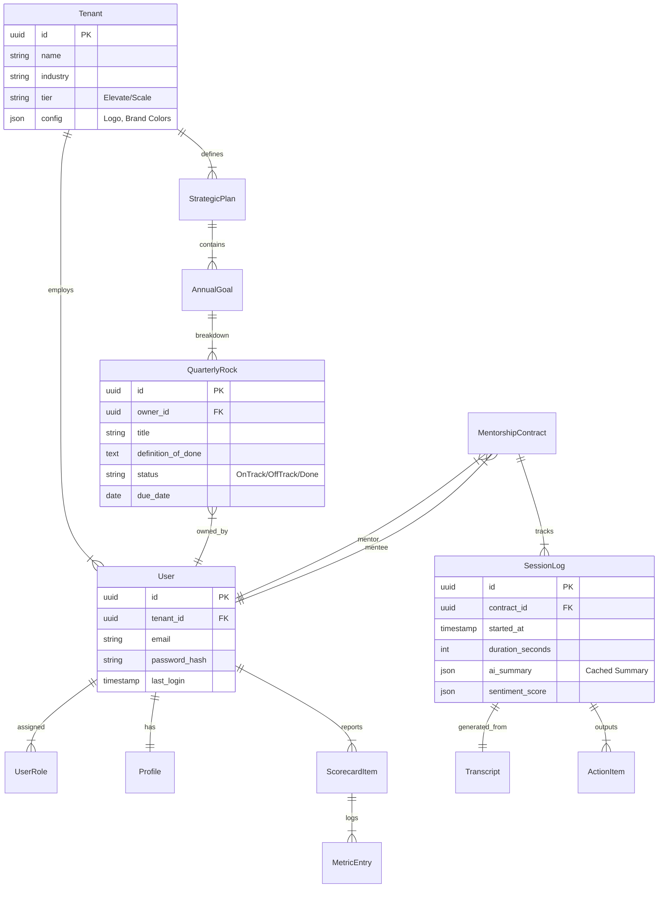

# Database Design & Entity Relationship Diagram (ERD)

## 1. Schema Design Philosophy
We utilize a **Polyglot Persistence** strategy to optimize for different data access patterns.
*   **Relational (PostgreSQL)**: The "Source of Truth". All core business data (Users, Payments, Strategy).
*   **Vector (Pinecone/Weaviate)**: Semantically indexed data for AI (Session transcripts, embeddings).
*   **Key-Value (Redis)**: High-speed caching for sessions and real-time meeting states.

## 2. Core ERD (PostgreSQL)

## 3. Advanced Data Modeling

### 3.1. Multi-Tenancy Strategy
*   **Row-Level Security (RLS)**: Every table has a `tenant_id` column.
*   **Policy**: Postgres RLS policies enforce that `current_user.tenant_id == row.tenant_id`. This prevents accidental data leakage between companies at the engine level.

### 3.2. "The History Table" Pattern (Audit)
*   For critical tables (StrategicPlan, User), we use a `_history` table or Temporal Tables to track changes over time.
    *   *Example*: `StrategicPlan` (Live) vs `StrategicPlanHistory` (Archive).
    *   *Use Case*: "Show me how our Core Values changed over the last 3 years."

### 3.3. JSONB for Flexibility
*   **Surveys & Assessments**: The questions for "Leadership Assessment" change frequently.
*   *Solution*: Store the dynamic form definition and answers in `JSONB` columns (`survey_schema`, `responses`). This avoids schema migrations for content changes.

## 4. Vector Database Schema (AI Memory)
*   **Collection**: `session_transcripts`
    *   **Vector**: 1536-dim embedding (OpenAI/Gemini).
    *   **Metadata**:
        *   `user_id`: For access control.
        *   `topic`: "Marketing", "Hiring", "Finance".
        *   `date`: ISO timestamp.
    *   *Query*: "Find all sessions where we discussed 'Cash Flow' in Q1."
