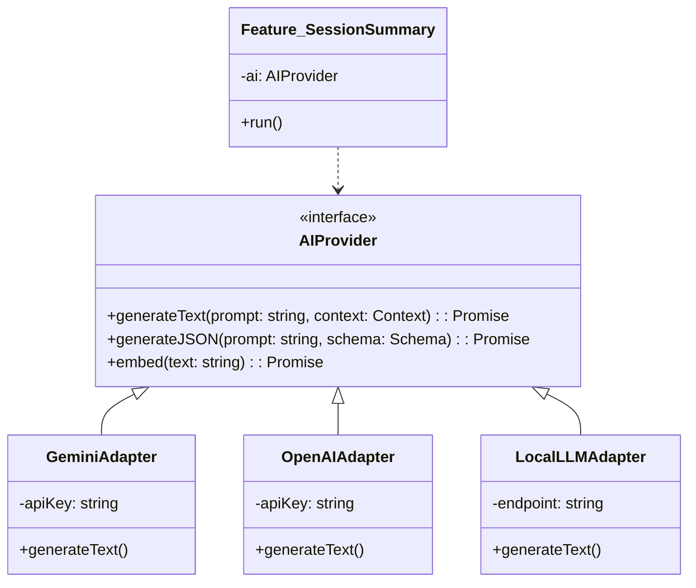

# AI Orchestration & LLM Abstraction Layer

## 1. The Core Requirement: "Model Agnosticism"
The AI landscape changes weekly. Today's leader (Gemini 1.5) might be surpassed by "GPT-5" or an Open Source model (Llama) next month.
**Strategic Goal**: Zero-code switching of AI providers.

## 2. The Abstraction Layer Design (The "Brain Adapter")

We do not import `google-generative-ai` directly in features. We import `AIProvider`.

### 2.1. Configuration-Driven Switching
Changing the model is a `.env` change, not a code deploy.
`AI_PROVIDER=gemini` -> Loads `GeminiAdapter`
`AI_PROVIDER=openai` -> Loads `OpenAIAdapter`

## 3. The "Orchestrator" Service (Prompt Management)
Prompts are not hardcoded strings. They are assets.
*   **Prompt Registry**: A database table storing prompt templates with versioning.
    *   `id`: "mentor-match-v2"
    *   `template`: "You are a helpful coach... Client is {{industry}}..."
*   **Benefits**: A Product Manager can tweak the prompt in the Admin Panel without asking a dev to redeploy.

## 4. RAG Pipeline (Retrieval Augmented Generation)
To give the AI "Long Term Memory", we use RAG.
1.  **Ingestion**: When a Session Transcript is saved, the orchestrator chunking the text (500 tokens).
2.  **Embedding**: Chunks are passed to `AIProvider.embed()` -> Vector.
3.  **Storage**: Vectors save to **Pinecone** with `user_id` metadata.
4.  **Retrieval**: When User asks "What did we say about hiring?", we query Pinecone, get top 3 chunks, and feed to LLM context window.

## 5. Security & Privacy Filters
*   **PII Redaction**: Before sending data to OpenAI/Gemini, a local Regex/NLP layer scans for Credit Card numbers or SSNs and masks them `[REDACTED]`.
*   **Enterprise Mode**: For high-security clients, we can swap to `LocalLLMAdapter` running on a private GPU instance (e.g., AWS Bedrock Private endpoint), guaranteeing no data leaves the VPC.
