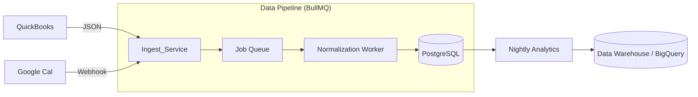

# Integration Strategy & Data Pipelines

## 1. Integration Philosophy: "Hub & Spoke"
ScaleIt 2.0 acts as the "Hub" (Central Command). Other tools (CRMs, Calendars, Banks) are "Spokes" that feed data in.

## 2. Key External Integrations

### 2.1. Calendar (Google/Microsoft 365)
*   **Purpose**: To detect "Coaching Sessions" automatically.
*   **Mechanism**: **Nylas** or **Merge.dev** API (Unified API providers).
    *   *Why?* Building direct Google Cal and Outlook integration is painful (recurring events, timezones). Unified APIs handle this.
*   **Data Flow**: Webhook `event.created` -> Check if attendee is Client -> Create Pending `Session` in ScaleIt.

### 2.2. Financials (QuickBooks/Xero)
*   **Purpose**: To populate the "Financial Scorecard".
*   **Mechanism**: **Codat.io** or **Plaid** (for Bank Feeds).
*   **Frequency**: Nightly Batch Job (Data Pipeline).
    *   `GET /profit-loss` -> Extract `Revenue`, `COGS` -> Store in `MetricEntry`.

### 2.3. Communication (Slack/Teams)
*   **Purpose**: Nudging users to update their Rocks.
*   **Mechanism**: Incoming Webhooks & Bot App.
*   **Feature**: User types `/scaleit update` in Slack -> Bot asks "What's the status of Rock #3?".

## 3. Data Pipeline Architecture (ETL)

### 3.1. Normalization Layer
*   *Problem*: QuickBooks calls it "Total Income", Xero calls it "Revenue".
*   *Solution*: The Pipeline maps external fields to our internal Schema (`finance.revenue`). This isolation ensures our App Logic (`Revenue > Target`) works regardless of the source.

## 4. Providing our API (Webhooks)
We enable ecosystem growth by allowing *others* to plug into ScaleIt.
*   **Outgoing Webhooks**:
    *   Event: `rock.completed`
    *   Payload: `{ "rock_id": 123, "user": "alice", "timestamp": "..." }`
    *   Use Case: Client wants to trigger a Zapier automation to play a victory song in the office.
