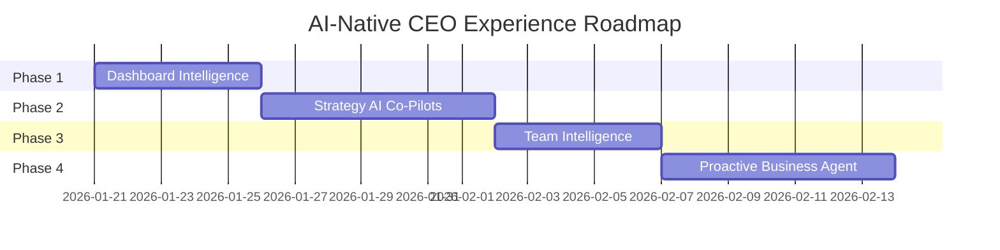

# AI-Native CEO Experience - Implementation Plan

This plan transforms ScaleIt 2.0 into a fully AI-native, agentic platform for CEOs. Every screen will provide intelligent guidance, predictive insights, and proactive assistance powered by Gemini AI.

---

## Current State Analysis

### Existing AI Integrations
The [geminiService.ts](file:///d:/MAIN%20FOLDER/Projects/ScaleIt%202.0/code/scaleit-251213/services/geminiService.ts) already provides:
- `getNextBestAction()` - Task/session prioritization
- `summarizeTranscript()` - Session note synthesis
- `getOrgChartSuggestions()` - Org structure advice
- `getLeadershipRecommendations()` - Development guidance
- `getMentorSuggestions()` - Mentor matching
- `generateJobDescription()` - Role creation
- `generateInterviewKit()` - Hiring support

### Key CEO Screens to Enhance

| Screen | Current State | AI Opportunity |
|--------|--------------|----------------|
| Dashboard | Basic NextBestAction widget | Rich contextual guidance, dynamic suggestions |
| Strategic Vision | Static form inputs | AI co-pilot, goal recommendations |
| Big Picture Vision | Manual entry | AI-assisted vision crafting |
| Growth Tracking | Chart display | Predictive insights, anomaly alerts |
| Org Chart Builder | Manual drag-drop | Smart role suggestions, gap analysis |
| Hiring Assistant | Form-based | End-to-end AI hiring workflow |
| Financial Forecasting | Static projections | Dynamic scenario modeling |

---

## Phase 1: Enhanced Dashboard Intelligence

> [!IMPORTANT]
> This phase establishes the foundation for agentic experiences across all screens.

### 1.1 Upgrade NextBestActionWidget

#### [MODIFY] [NextBestActionWidget.tsx](file:///d:/MAIN%20FOLDER/Projects/ScaleIt%202.0/code/scaleit-251213/features/dashboard/components/NextBestActionWidget.tsx)

Transform from single suggestion to multi-action guidance:

```diff
- Single text suggestion
+ Prioritized action cards with:
  + Action title + reasoning
  + Estimated impact (High/Medium/Low)
  + Quick action buttons (Schedule, Delegate, Complete)
  + "Why this?" expandable explanation
```

---

### 1.2 Add Dynamic Suggestions Panel

#### [NEW] [DynamicSuggestionsWidget.tsx](file:///d:/MAIN%20FOLDER/Projects/ScaleIt%202.0/code/scaleit-251213/features/dashboard/components/DynamicSuggestionsWidget.tsx)

Context-aware suggestions based on:
- Time of day and day of week patterns
- Recent user activity and page visits
- Pending deadlines and upcoming sessions
- Business health metrics

Features:
- Rotating carousel of 3-5 personalized suggestions
- One-click action shortcuts
- "Remind me later" / "Not relevant" feedback

---

### 1.3 Create AI Executive Greeting

#### [MODIFY] [DashboardPage.tsx](file:///d:/MAIN%20FOLDER/Projects/ScaleIt%202.0/code/scaleit-251213/features/dashboard/pages/DashboardPage.tsx)

Replace static greeting with dynamic AI summary:

```diff
- `Welcome back, ${MOCK_USER.name}. Here's your focus for this week.`
+ AI-generated contextual greeting including:
  + Business pulse (key metrics status)
  + Today's priorities with reasoning
  + Proactive alerts (deadlines, anomalies)
  + Personalized encouragement
```

---

### 1.4 Gemini Service Extensions

#### [MODIFY] [geminiService.ts](file:///d:/MAIN%20FOLDER/Projects/ScaleIt%202.0/code/scaleit-251213/services/geminiService.ts)

Add new functions:

```typescript
// Prioritized actions with reasoning
getEnhancedNextBestActions(context: CEOContext): Promise<PrioritizedAction[]>

// Dynamic greeting with business pulse  
generateExecutiveGreeting(user: User, metrics: BusinessMetrics): Promise<ExecutiveGreeting>

// Context-aware suggestions
getDynamicSuggestions(userActivity: ActivityLog, context: CEOContext): Promise<Suggestion[]>
```

---

## Phase 1.5: Proactive CEO Agent (Central Intelligence Hub)

> [!IMPORTANT]
> This agent aggregates context from ALL functionalities to provide hourly/daily intelligent updates.

### 1.5.1 CEO Agent Service

#### [NEW] [ceoAgentService.ts](file:///d:/MAIN%20FOLDER/Projects/ScaleIt%202.0/code/scaleit-251213/services/ceoAgentService.ts)

Central intelligence service that monitors:
- **Tasks**: Pending, overdue, completed trends
- **Sessions**: Upcoming, missed, action items from past sessions
- **Goals**: Progress, at-risk, achieved milestones
- **Team**: Hiring needs, org changes, performance signals
- **Financials**: Cash flow alerts, growth metrics, forecasts
- **Strategy**: Gap analysis status, vision alignment

Provides:
```typescript
interface AgentUpdate {
  type: 'daily' | 'hourly' | 'realtime';
  followUps: FollowUpItem[];        // "Follow up with mentor about Q1 goals"
  actionItems: PrioritizedAction[]; // From sessions, deadlines
  summaries: ContextSummary[];      // What happened since last check
  alerts: Alert[];                  // Risks, anomalies, deadlines
  reminders: Reminder[];            // Scheduled items, recurring tasks
  suggestions: Suggestion[];        // Proactive opportunities
  reasoning: string;                // Why these were selected
}

// Core agent functions
generateAgentUpdate(context: FullBusinessContext): Promise<AgentUpdate>
getFollowUpItems(sessions: Session[], tasks: Task[]): Promise<FollowUpItem[]>
generateDailySummary(allModuleData: ModuleData[]): Promise<DailySummary>
detectAnomalies(metrics: AllMetrics): Promise<Alert[]>
```

---

### 1.5.2 CEO Agent Widget

#### [NEW] [CEOAgentWidget.tsx](file:///d:/MAIN%20FOLDER/Projects/ScaleIt%202.0/code/scaleit-251213/features/dashboard/components/CEOAgentWidget.tsx)

Prominent dashboard widget with:
- **Real-time feed** of agent updates
- **Tabbed view**: Follow-ups | Action Items | Alerts | Suggestions
- **Time filter**: Last hour | Today | This week
- **Priority indicators** with AI reasoning
- **One-click actions** (Schedule, Dismiss, Snooze, Delegate)
- **"Ask Agent"** quick query input

Visual design:
- Persistent left panel or collapsible sidebar
- Badge notifications for urgent items
- Expandable cards with full context

---

### 1.5.3 Background Polling & Notifications

#### [NEW] [agentPollingService.ts](file:///d:/MAIN%20FOLDER/Projects/ScaleIt%202.0/code/scaleit-251213/services/agentPollingService.ts)

- Configurable intervals: 15min / 30min / 1hr / 4hr
- Smart batching (don't overwhelm user)
- Browser notifications for critical alerts
- Session storage of dismissals

---

### 1.5.4 Agent Context Collectors

Data aggregation from all modules:

| Module | Data Collected |
|--------|---------------|
| Dashboard | Pending tasks, upcoming sessions, goals progress |
| Strategy | Vision gaps, milestone status, growth trajectory |
| Team | Open positions, org changes, member updates |
| Mentor | Session notes, action items, follow-up needs |
| Calendar | Upcoming events, missed meetings, scheduling conflicts |
| Billing | Payment status, subscription renewals |
| Reporting | Metric changes, anomalies, trends |

### 2.1 AI Co-Pilot for Strategic Vision

#### [MODIFY] [StrategicVisionPage.tsx](file:///d:/MAIN%20FOLDER/Projects/ScaleIt%202.0/code/scaleit-251213/features/strategy/pages/StrategicVisionPage.tsx)

Add floating AI co-pilot panel:
- Real-time suggestions as user types goals
- Industry benchmark comparisons
- "Generate goals for me" based on assessment results
- Challenge/validate existing goals with AI analysis

---

### 2.2 AI-Assisted Big Picture Vision

#### [MODIFY] [BigPictureVisionPage.tsx](file:///d:/MAIN%20FOLDER/Projects/ScaleIt%202.0/code/scaleit-251213/features/strategy/pages/BigPictureVisionPage.tsx)

- "Help me articulate my vision" wizard
- AI-generated mission statement drafts
- Value proposition refinement suggestions
- Competitive positioning insights

---

### 2.3 Intelligent Gap Analysis

#### [MODIFY] [ScalableModelsPage.tsx](file:///d:/MAIN%20FOLDER/Projects/ScaleIt%202.0/code/scaleit-251213/features/strategy/pages/ScalableModelsPage.tsx)

- Auto-detect gaps from assessment data
- Prioritized gap remediation roadmap
- Resource allocation recommendations
- Timeline estimation with AI

---

### 2.4 Predictive Growth Insights

#### [MODIFY] [GrowthTrackingPage.tsx](file:///d:/MAIN%20FOLDER/Projects/ScaleIt%202.0/code/scaleit-251213/features/strategy/pages/GrowthTrackingPage.tsx)

- Trend prediction overlays on charts
- "What-if" scenario modeling
- Anomaly detection with explanations
- AI-generated growth narrative

---

### 2.5 New Gemini Functions

```typescript
// Vision crafting assistance
generateVisionDraft(inputs: VisionInputs): Promise<VisionDraft>

// Gap prioritization
prioritizeGaps(gaps: Gap[], resources: Resources): Promise<PrioritizedGap[]>

// Scenario modeling
modelGrowthScenario(baseline: Metrics, changes: ScenarioChanges): Promise<Projection>
```

---

## Phase 3: Team & Org Intelligence

### 3.1 Enhanced Hiring Recommendations

#### [MODIFY] [HiringAssistantPage.tsx](file:///d:/MAIN%20FOLDER/Projects/ScaleIt%202.0/code/scaleit-251213/features/team/pages/HiringAssistantPage.tsx)

Full agentic hiring workflow:
- "I need to hire for..." conversational start
- AI-suggested role based on business gaps
- Auto-generated job description + interview kit
- Candidate screening criteria suggestions
- Salary range recommendations by market

---

### 3.2 Intelligent Org Chart Suggestions

#### [MODIFY] [OrgChartBuilderPage.tsx](file:///d:/MAIN%20FOLDER/Projects/ScaleIt%202.0/code/scaleit-251213/features/team/pages/OrgChartBuilderPage.tsx)

Enhance existing AI suggestions:
- Proactive restructure recommendations
- Span of control analysis
- Succession planning insights
- Role consolidation opportunities

---

### 3.3 Smart Team Performance Insights

#### [NEW] [TeamInsightsWidget.tsx](file:///d:/MAIN%20FOLDER/Projects/ScaleIt%202.0/code/scaleit-251213/features/team/components/TeamInsightsWidget.tsx)

AI-powered team health dashboard:
- Engagement score predictions
- Flight risk indicators
- Development opportunity matching
- Team dynamics analysis

---

### 3.4 AI Meeting Preparation

#### [MODIFY] [UpcomingSessionsWidget.tsx](file:///d:/MAIN%20FOLDER/Projects/ScaleIt%202.0/code/scaleit-251213/features/dashboard/components/UpcomingSessionsWidget.tsx)

- Pre-meeting briefing generation
- Suggested talking points
- Previous session context summary
- Follow-up action reminders

---

## Phase 4: Proactive Business Agent

### 4.1 AI Command Palette

#### [NEW] [CommandPalette.tsx](file:///d:/MAIN%20FOLDER/Projects/ScaleIt%202.0/code/scaleit-251213/components/CommandPalette.tsx)

`Ctrl/Cmd + K` accessible anywhere:
- Natural language commands ("Schedule a call with my mentor")
- Quick actions ("Show me this month's growth")
- AI-powered search across all data
- Contextual action suggestions

---

### 4.2 Predictive Alerts System

#### [NEW] [AlertsService.ts](file:///d:/MAIN%20FOLDER/Projects/ScaleIt%202.0/code/scaleit-251213/services/alertsService.ts)

Proactive notification engine:
- Goal milestone approaching/at risk
- Unusual metric changes
- Deadline reminders with context
- Opportunity windows (best time to hire, etc.)

#### [NEW] [AlertsWidget.tsx](file:///d:/MAIN%20FOLDER/Projects/ScaleIt%202.0/code/scaleit-251213/features/dashboard/components/AlertsWidget.tsx)

Visual alert center with AI explanations.

---

### 4.3 AI Reporting Summaries

#### [MODIFY] [ProgramAnalytics.tsx](file:///d:/MAIN%20FOLDER/Projects/ScaleIt%202.0/code/scaleit-251213/features/reporting/pages/ProgramAnalytics.tsx)

- Executive summary generation
- Key insights extraction
- Trend narratives
- Share-ready report export

---

### 4.4 Enhanced Global Chat

#### [MODIFY] [GlobalChatWidget.tsx](file:///d:/MAIN%20FOLDER/Projects/ScaleIt%202.0/code/scaleit-251213/components/GlobalChatWidget.tsx)

Transform to full business assistant:
- Query any business data conversationally
- Execute actions via chat ("Create a task for...")
- Cross-reference multiple data sources
- Proactive suggestions in conversation

---

## Implementation Timeline



---

## Verification Plan

### Automated Tests

No existing test files found for UI components. Will create integration tests for new Gemini functions:

```bash
# Run after Phase 1 Gemini extensions
npm run test -- --grep "geminiService"
```

### Browser Testing

Each phase will be validated using browser testing:

1. **Phase 1 Verification**
   - Navigate to Dashboard at http://localhost:3000
   - Verify NextBestActionWidget shows multiple prioritized actions
   - Check dynamic suggestions carousel rotates properly
   - Confirm AI greeting reflects current context

2. **Phase 2 Verification**
   - Navigate to Strategy > Strategic Vision
   - Test AI co-pilot suggestions appear while typing
   - Verify "Generate goals" button produces relevant output
   - Check Gap Analysis shows prioritized recommendations

3. **Phase 3 Verification**
   - Navigate to Team > Hiring Assistant
   - Test conversational hiring flow
   - Verify Org Chart AI suggestions are relevant
   - Check Team Insights widget displays correctly

4. **Phase 4 Verification**
   - Test `Ctrl+K` opens Command Palette anywhere
   - Verify natural language commands work
   - Check Alerts widget shows proactive notifications
   - Test Global Chat can query business data

### Manual Verification

> [!NOTE]
> Each phase should be reviewed by the user before proceeding to the next.

After each phase:
1. Run `npm run dev` to start the application
2. Navigate through affected screens
3. Test all AI-powered features
4. Verify responses are contextually appropriate
5. Check loading states and error handling

---

## User Review Required

> [!IMPORTANT]
> Please review the following before we proceed:

1. **Phase Prioritization**: Are these phases in the right order for your needs?
2. **Feature Scope**: Any features you'd like to add or remove?
3. **AI Behavior**: Any specific personality/tone preferences for the AI responses?
4. **Data Sources**: Are the current mock data sources sufficient, or do you need real data integrations?
