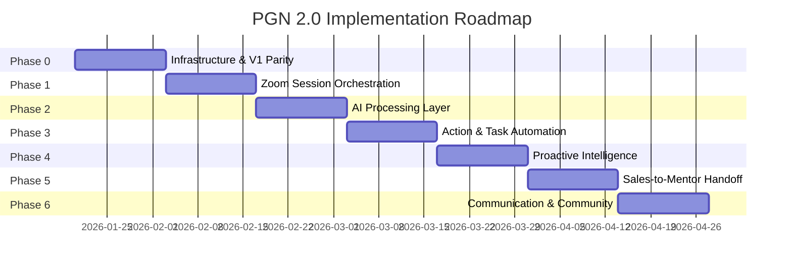

# PGN Software 2.0 - Master Implementation Plan

> **Vision**: Transform PGN from a manual mentor-client platform into an AI-native, agentic orchestration system that captures conversations, automates execution tracking, and delivers proactive intelligence to all stakeholders.

---

## Executive Summary

| Dimension | V1 (Current) | V2 (Target) |
|-----------|--------------|-------------|
| **Session Management** | External Zoom, manual logging | Integrated Zoom with auto-transcription |
| **Action Items** | In notes or memory | AI-extracted, auto-tracked |
| **Progress Tracking** | Manual data entry | Conversation-driven automation |
| **Dashboards** | Retrospective visibility | Proactive alerts & insights |
| **SCALE-IT** | Content organization | Operating logic for all AI outputs |

---

## Foundation: SCALE-IT as the Operating Layer

> [!IMPORTANT]
> SCALE-IT is not a feature — it is the **primary organizing layer** for all AI outputs, dashboards, and reporting.

| Pillar | Application |
|--------|-------------|
| **S**trategic Vision | Goals, Big Picture Vision, Gap Analysis |
| **C**ash Flow | Financial forecasting, KPI tracking |
| **A**lliance of Team | Org chart, hiring, team health |
| **L**eadership | Assessments, development plans |
| **E**xecution | Action items, tasks, milestones |

All AI-generated content will be tagged to SCALE-IT pillars for consistent filtering and reporting.

---

## Roles & Access Model

| Role | Capabilities | V2 Additions |
|------|--------------|--------------|
| **PINN (Member)** | Plans, goals, sessions, content | AI summaries, proactive suggestions |
| **Mentor** | Client roster, session management | AI insights, red flag alerts, meeting prep |
| **Admin** | User provisioning, oversight | Analytics dashboards, program health |
| **Sales** *(New)* | Prospect assessments, handoff | Fit scoring, structured onboarding packages |

---

## Phase 0: Infrastructure & V1 Parity (Week 1-2)

### 0.1 Cloud Architecture Setup

#### [NEW] [infrastructure/](file:///d:/MAIN%20FOLDER/Projects/ScaleIt%202.0/code/scaleit-251213/infrastructure/)

- Cloud-native deployment configuration
- API Gateway setup
- Database schema migration from V1
- Role-based access control (RBAC) implementation

### 0.2 V1 Feature Parity Validation

Ensure all V1 capabilities are functional:
- [ ] Member Directory
- [ ] Growth Tracking
- [ ] Action Planning (Tasks → Milesteps → Mini-feats)
- [ ] Big Picture Vision
- [ ] Snapshot & Score Tracker
- [ ] Content Library (SCALE-IT organized)

---

## Phase 1: Zoom-Centered Session Orchestration (Week 2-4)

> [!IMPORTANT]
> Conversations are the **primary asset** of PGN — currently they are lost.

### 1.1 Zoom Integration Service

#### [NEW] [services/zoomService.ts](file:///d:/MAIN%20FOLDER/Projects/ScaleIt%202.0/code/scaleit-251213/services/zoomService.ts)

```typescript
interface ZoomService {
  // Scheduling
  createMeeting(session: SessionRequest): Promise<ZoomMeeting>
  syncCalendar(provider: 'google' | 'outlook' | 'ical'): Promise<void>
  
  // Recording & Transcription
  fetchRecording(meetingId: string): Promise<Recording>
  processTranscript(recording: Recording): Promise<Transcript>
  
  // Lifecycle
  onMeetingEnded(meetingId: string): Promise<SessionMetadata>
}
```

### 1.2 Session Lifecycle Manager

#### [NEW] [features/sessions/](file:///d:/MAIN%20FOLDER/Projects/ScaleIt%202.0/code/scaleit-251213/features/sessions/)

Session states: `Scheduled → Held → Processing → Insights Ready`

- Automatic Zoom meeting creation on session schedule
- Calendar sync (Google Calendar, Outlook, iCal)
- Recording retrieval post-session
- Transcript storage and metadata capture

### 1.3 Session Dashboard Integration

#### [MODIFY] [UpcomingSessionsWidget.tsx](file:///d:/MAIN%20FOLDER/Projects/ScaleIt%202.0/code/scaleit-251213/features/dashboard/components/UpcomingSessionsWidget.tsx)

- One-click "Join Zoom" from dashboard
- Session status indicators
- Recording availability badges

---

## Phase 2: AI Processing & Intelligence Layer (Week 4-6)

### 2.1 Transcript Ingestion Pipeline

#### [NEW] [services/aiProcessingService.ts](file:///d:/MAIN%20FOLDER/Projects/ScaleIt%202.0/code/scaleit-251213/services/aiProcessingService.ts)

```typescript
interface AIProcessingService {
  // Core Processing
  ingestTranscript(transcript: Transcript): Promise<ProcessedSession>
  
  // Extraction
  extractSummary(transcript: string): Promise<SessionSummary>
  extractDecisions(transcript: string): Promise<Decision[]>
  extractCommitments(transcript: string): Promise<Commitment[]>
  extractRisks(transcript: string): Promise<RiskSignal[]>
  extractOpportunities(transcript: string): Promise<Opportunity[]>
  
  // SCALE-IT Tagging
  tagToScaleIt(content: any): Promise<ScaleItTags>
}
```

### 2.2 AI Guardrails Implementation

> [!CAUTION]
> AI assists — never dictates. Mentor always reviews and approves AI outputs.

- All AI outputs marked as "AI Suggested"
- Mentor approval required before action items become tasks
- Edit/reject/approve workflow for all AI extractions
- Confidence scores displayed for transparency

### 2.3 Session Workspace

#### [NEW] [features/sessions/pages/SessionWorkspacePage.tsx](file:///d:/MAIN%20FOLDER/Projects/ScaleIt%202.0/code/scaleit-251213/features/sessions/pages/SessionWorkspacePage.tsx)

Post-session view with:
- Full transcript (searchable)
- AI-generated summary
- Extracted decisions (editable)
- Suggested action items (approve/edit/reject)
- Risk signals highlighted
- SCALE-IT pillar tags

---

## Phase 3: Action Item & Task Automation (Week 6-8)

### 3.1 Commitment Extraction Engine

#### [MODIFY] [geminiService.ts](file:///d:/MAIN%20FOLDER/Projects/ScaleIt%202.0/code/scaleit-251213/services/geminiService.ts)

```typescript
interface ExtractedCommitment {
  text: string;
  owner: 'member' | 'mentor';
  suggestedDeadline: Date | null;
  urgency: 'high' | 'medium' | 'low';
  scaleItPillar: ScaleItPillar;
  businessContext: string;
  sourceQuote: string; // From transcript
}

extractCommitments(transcript: string): Promise<ExtractedCommitment[]>
```

### 3.2 Action Item Workflow

#### [MODIFY] [PendingTasksWidget.tsx](file:///d:/MAIN%20FOLDER/Projects/ScaleIt%202.0/code/scaleit-251213/features/dashboard/components/PendingTasksWidget.tsx)

- AI-suggested tasks appear in "Review" section
- One-click approve to add to task list
- Bulk approve/reject interface
- Auto-link to source session

### 3.3 Quarterly Goals Automation

#### [NEW] [features/goals/](file:///d:/MAIN%20FOLDER/Projects/ScaleIt%202.0/code/scaleit-251213/features/goals/)

- AI-generated quarterly goals from session patterns
- Mentor/member review & approval workflow
- Automatic progress signals from future sessions
- SCALE-IT alignment scoring

---

## Phase 4: Proactive Intelligence Agent (Week 8-10)

### 4.1 Central Intelligence Service

#### [NEW] [services/ceoAgentService.ts](file:///d:/MAIN%20FOLDER/Projects/ScaleIt%202.0/code/scaleit-251213/services/ceoAgentService.ts)

Aggregates context from ALL modules:

| Source | Intelligence Generated |
|--------|----------------------|
| Sessions | Follow-ups, action items, decisions |
| Tasks | Overdue alerts, completion trends |
| Goals | At-risk milestones, progress signals |
| Metrics | Anomalies, growth opportunities |
| Calendar | Scheduling conflicts, prep reminders |

### 4.2 Role-Specific Dashboards

#### Member (PINN) Dashboard
- Upcoming sessions with prep suggestions
- Action items with AI context
- Quarterly goal progress
- AI summaries of recent sessions

#### Mentor Dashboard
- Client roster with health indicators
- Red flag alerts (missed sessions, stalled progress)
- Comparative client performance
- Meeting prep packages

#### Admin Dashboard
- Program-wide engagement metrics
- Mentor consistency scoring
- Outcome tracking by SCALE-IT pillar
- Prospect pipeline visibility

### 4.3 Agent Widget

#### [NEW] [CEOAgentWidget.tsx](file:///d:/MAIN%20FOLDER/Projects/ScaleIt%202.0/code/scaleit-251213/features/dashboard/components/CEOAgentWidget.tsx)

- Real-time feed: Follow-ups | Action Items | Alerts | Suggestions
- Time filters: Last hour | Today | This week
- One-click actions: Schedule, Dismiss, Snooze, Delegate
- "Ask Agent" quick query

---

## Phase 5: Sales-to-Mentor Handoff (Week 10-12)

### 5.1 Sales Assessment Ingestion

#### [NEW] [features/sales/](file:///d:/MAIN%20FOLDER/Projects/ScaleIt%202.0/code/scaleit-251213/features/sales/)

- Sales Zoom call integration
- AI-generated fit scoring
- Risk indicator detection
- Needs/concerns extraction

### 5.2 Handoff Package Generator

```typescript
interface HandoffPackage {
  prospect: ProspectProfile;
  salesCallSummary: string;
  fitScore: number;
  riskIndicators: RiskIndicator[];
  identifiedNeeds: Need[];
  recommendedApproach: string;
  recordings: Recording[];
  transcripts: Transcript[];
}

generateHandoffPackage(salesCall: ProcessedSession): Promise<HandoffPackage>
```

### 5.3 Mentor Onboarding View

#### [NEW] [features/mentor/pages/ClientOnboardingPage.tsx](file:///d:/MAIN%20FOLDER/Projects/ScaleIt%202.0/code/scaleit-251213/features/mentor/pages/ClientOnboardingPage.tsx)

- Complete prospect context before first session
- AI-suggested first session agenda
- Risk-aware relationship kickoff

---

## Phase 6: Communication & Community (Week 12-14)

### 6.1 In-App Messaging

#### [MODIFY] [features/communication/](file:///d:/MAIN%20FOLDER/Projects/ScaleIt%202.0/code/scaleit-251213/features/communication/)

- 1-to-1 messaging between PINN/Mentor
- Group discussions for cohorts
- AI summarization for long threads
- File sharing with context

### 6.2 Events & Notifications

- Workshop/cohort meeting scheduling
- Text and email notifications
- Calendar integration
- AI-generated event reminders

---

## Implementation Timeline



---

## MVP Scope Definition

### Must Ship (MVP)

| Feature | Phase |
|---------|-------|
| Zoom scheduling & calendar sync | 1 |
| Recording retrieval & transcript storage | 1 |
| AI session summaries | 2 |
| Action item extraction | 3 |
| Member & Mentor dashboards | 4 |

### Post-MVP

| Feature | Phase |
|---------|-------|
| Sales role & handoff automation | 5 |
| AI quarterly goals | 3 |
| Community features | 6 |
| Predictive alerts | 4 |

---

## Success Metrics (First 90 Days)

| KPI | Target |
|-----|--------|
| Mentor adoption rate | 80%+ |
| PINN engagement (sessions/month) | 4+ |
| Admin effort reduction | 50% |
| AI output accuracy (approved vs rejected) | 85%+ |
| Action item completion rate | 60%+ |

---

## Security & Compliance

### Data Protection
- Role-based access control
- Session recordings encrypted at rest
- Transcript access limited by role

### Audit Requirements
- All AI outputs logged with approval status
- Session participation tracked
- Admin oversight dashboards

### Retention Policy
- Recordings: 12 months (configurable)
- Transcripts: 24 months
- AI outputs: Permanent with audit trail

---

## Decisions Required

> [!WARNING]
> Please confirm the following before we proceed:

1. **Zoom Integration Scope**: Full API integration or simpler calendar-only approach for MVP?
2. **AI Autonomy Level**: Should AI create draft tasks automatically, or only suggest?
3. **Sales Role Separation**: Confirm Sales vs Admin role boundaries
4. **MVP Timeline**: Is 8-10 weeks for MVP feasible?
5. **Data Sources**: Continue with mock data or integrate real backend?
