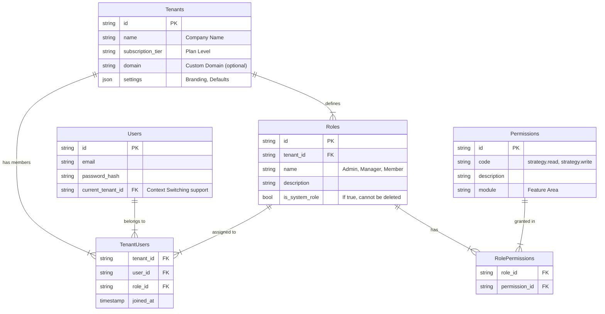
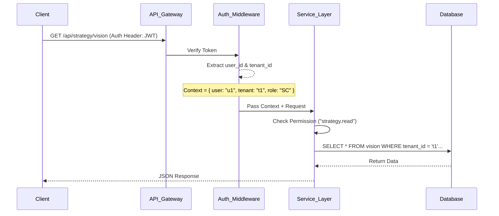

# Multi-Tenancy & RBAC Architecture Proposal

## 1. Executive Summary

This document proposes a **Multi-Tenant Architecture** for ScaleIt 2.0, utilizing a **Logical Isolation Strategy** (discriminator column) combined with a robust **Role-Based Access Control (RBAC)** system. This approach balances agility, cost-efficiency, and scalability, allowing thousands of tenants (organizations/companies) to coexist securely within a shared infrastructure.

## 2. Multi-Tenancy Strategy

### 2.1. Isolation Model: "Shared Database, Shared Schema"

We recommend the **Discriminator Column** approach (Pool Model) where all tenant data resides in the same tables but is logically isolated via a `tenant_id` column.

*   **Rationale:**
    *   **Simplicity:** Easiest to manage migrations and deployments (no running migrations for 1000s of schemas).
    *   **Cost:** Resource efficient; no overhead of separate DB instances/schemas.
    *   **Scalability:** Horizontal scaling of the application layer is stateless. DB can be sharded later if needed.
    *   **DevEx:** Simplified local development setup.

### 2.2. Row-Level Security (RLS)

To enforcing strict isolation, we will implementing security at multiple layers:
1.  **Application Layer:** Middleware injects `tenant_id` into the query context (e.g., ORM filters).
2.  **Database Layer (Recommended Future State):** Use Postgres Row-Level Security (RLS) policies to ensure no query can cross-pollinate data, even if the app code has a bug.

## 3. RBAC Schema & Hierarchy

We need to formalize the relationship between **Users**, **Tenants (Companies)**, and **Global Platform Administration**.

### 3.1. Entity Relationships (ERD)

### 3.2. Defined Roles

We will map the existing ScaleIt abbreviations to this system:

| Level | Role Code | Role Name | Scope | Description |
| :--- | :--- | :--- | :--- | :--- |
| **Platform** | `SA` | Super Admin | **Global** | Full access to all tenants, billing, and system config. PGN Staff only. |
| **Platform** | `AM` | Admin Manager | **Global** | Manage support, content updates, and tenant onboarding. |
| **Tenant** | `SC` | Scale Client (Owner) | **Tenant** | Tenant Owner. Full control over billing, users, and strategy. |
| **Tenant** | `STM` | Scale Team Member | **Tenant** | Employee of the Tenant. Access determined by granular permissions. |
| **Tenant** | `EC` | Elevate Client | **Tenant** | Solopreneur Tenant. Simplified single-user view. |

## 4. System Design & Data Flow

### 4.1. Authentication & Context Flow

1.  **Login:**
    *   User posts credentials to `/auth/login`.
    *   Backend validates password.
    *   **Tenant Resolution:**
        *   If user belongs to 1 tenant -> Return Token with that `tenant_id`.
        *   If user belongs to N tenants -> Return list of choices. User selects one -> Return Token.

2.  **Request Flow:**

### 4.2. API Design Implications

*   **URL Structure:**
    *   Standard: `api.scaleit.com/v1/strategy` (Tenant context from Header/Token).
*   **Header Injection:**
    *   Every request must carry the `Authorization` header.
    *   **Critical:** The backend *MUST* trust the token's `tenant_id`, not a body parameter, to prevent IDOR attacks.

## 5. Implementation Roadmap

### Phase 1: Foundation (Current)
*   [ ] Add `tenant_id` column to all feature tables (`strategic_plans`, `model_history`, etc.).
*   [ ] Update `UserContext` in frontend to include `tenantId`.

### Phase 2: Middleware & Security
*   [ ] Implement Backend Middleware to reject requests without `tenant_id`.
*   [ ] Enforce RLS policy equivalents in Service Layer queries.

### Phase 3: Tenant Management
*   [ ] Create "Super Admin" dashboard for PGN staff to create/suspend tenants.
*   [ ] Create "Team Settings" page for SC users to invite STMs.

## 6. Migration Plan for Existing Data
*   Create a "Default Tenant" (Seed Data).
*   Assign all current mock/local data to this Default Tenant ID.
*   Ensure the application defaults to this tenant during the transition.
